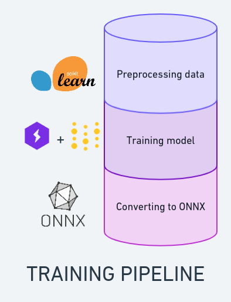
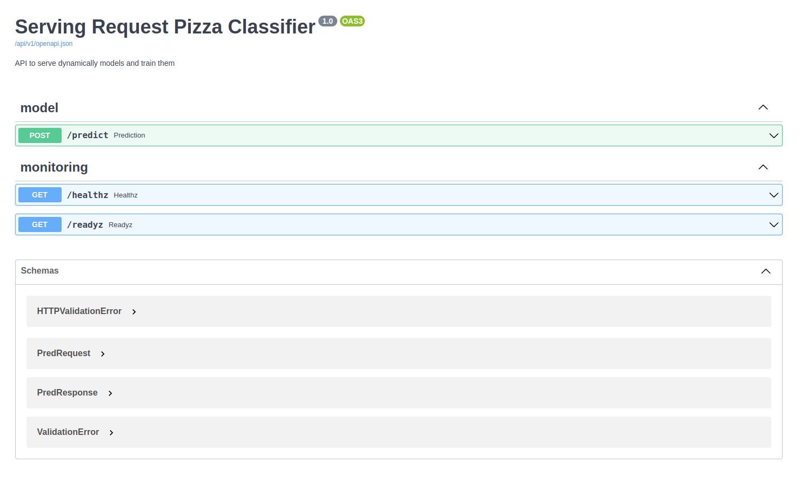
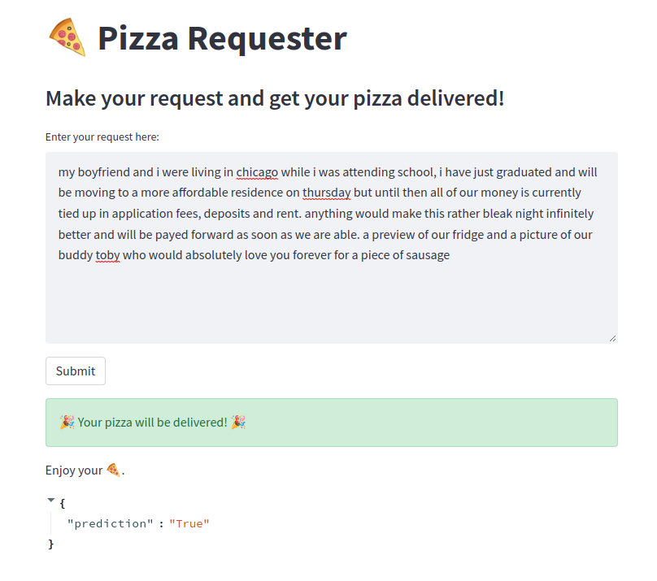

# 🍕 Pizza Challenge

This is the documentation for the challenge, how it works and what I did during this week.

<center>


<em>Me working on the challenge...</em>
</center>

## 📅 Planning

I started by thinking about the problem in a way that I could understand it.

**What is the challenge goal?** 

**What is the problem?**

**What type of data do we have?** 

**What do I need to build as a solution?**

This is the plan I have set out for the challenge:


I followed most of the plan and its order, but machine learning problems are more and iterative process than a linear one.

Since the beginning of the challenge I wanted to try a classic machine learning model to solve the problem, and then
try a deep learning model to see which one is better and if it's worth it to use for the challenge.

## 🧹 Cleaning and Exploring the Data - [Notebook](https://github.com/ChainYo/pizza-challenge/blob/master/notebooks/cleaning.ipynb)

I started the exploration with a bit of data cleaning.

There was some missing data in the dataset and some unnecessary data.

## 🔎 More Data Exploration - [Notebook](https://github.com/ChainYo/pizza-challenge/blob/master/notebooks/exploration.ipynb)

Then, I started really exploring the data.

I focused on text data which is the most relevant for this challenge in my opinion.

So, I cleaned with `regex` request text data and did some wordclouds.

Here is the wordcloud of the most common words in the `requester_text` column:


I also found that negative requests contain a lot of misspellings.

## ⚙️ Preprocessing - [Notebook](https://github.com/ChainYo/pizza-challenge/blob/master/notebooks/preprocessing.ipynb)

Then I started to preprocess the data before building any model.

I have replaced `True` and `False` with `1` and `0` in the `requester_received_pizza` column which will be the target column.

I also arranged some columns in a way that I could use them for a training if needed.

## 🧭 First Model - [Notebook](https://github.com/ChainYo/pizza-challenge/blob/master/notebooks/random_forest_classifier.ipynb)

I started with the idea to build a simple `RandomForestClassifier` model on only the text data.

I used an old notebook I had written months ago where I used `nltk` and `gensim.word2vec` to build a word2vec model.

So I used `nltk` to tokenize the text data in order to build the vocabulary of the model. This model can be used 
to create clusters of words that are similar to each other. 

226 clusters were created and used to create a mapping between the words and their clusters. 

This mapping is used to create multiple bags of centroids, which are used to create the features for the model.

With the dataset created, I started to train the model. I used `Optuna` to optimize the hyperparameters of the model and
to help me find the best model.


As you can see, the model is not *very good*. 😅

Because, I'm not really confident in the model choice and the tools I used, I decided to give up on this approach and
try a deep learning model, which passion me more.

## 🧠 Deep Learning Model - [Notebook](https://github.com/ChainYo/pizza-challenge/blob/master/notebooks/deep_learning.ipynb) | [Implementation](https://github.com/ChainYo/pizza-challenge/blob/master/src/pizza_challenge/pipelines/training/model.py)

I switched to a deep learning model and started to think about the problem and which model to use.

I decided to **fine tune a transformers model** on a downstream task, which is a **classification task** in this case.

As a backbone of the model, I used a `bert-base-uncased` model which is a pretrained model from the **Hugging Face** library.

The model has been trained to be able to read and understand english text, so it will be fine for our task.

In order to fine tune the model, I have added a simple classification layer to the model.

I used `PyTorch-Lightning` for the implementation of the model, because it's the **best library for implementing deep
learning models and deploying them on a production environment**.

All training logs are saved via `Weights and Biases` and could be accessed via the [Project Pizza Challenge](https://wandb.ai/chainyo-mleng/challenge) on [Weights and Biases](https://wandb.ai/).

Let's take a look at the training pipeline:



I used `Kedro` to package the pipeline and it allows me to **run the pipeline on a local machine or on a cloud**.

With only the command `kedro run` I could run the pipeline and train another model and export it to ONNX. The new
model will be placed in the api folder and can be used to predict the pizza requests.

## 💅 ONNX Optimization - [Implementation](https://github.com/ChainYo/pizza-challenge/blob/master/src/pizza_challenge/pipelines/training/nodes.py#L114)

ONNX is a format for storing and running deep learning models on any hardware and with any coding language.

You can run models on the CPU, GPU, or even edge TPUs. It's possible to launch `InferenceSession` on Python, C++, or
Java (and many more).

It's really a great way to package your model and run it on production environments. Plus, it allows **faster inference
times on CPUs**.

## 🧃 Serving API - [Implementation](https://github.com/ChainYo/pizza-challenge/tree/master/api)

This is the API that I have created to serve the model. It's a simple `FastAPI` server that has a `POST` endpoint
that accepts a JSON payload with a `sample` field and returns a `JSON` response with a `prediction` field.



The API is dockerized and could be **deployed on any cloud service**. I have added 2 monitoring endpoints `healthz` and
`readyz` to check if the server is running and ready to serve requests. These endpoints are used by **Kubernetes** for 
automated deployments.

## 🖥️ Interface - [Implementation](https://github.com/ChainYo/pizza-challenge/tree/master/interface)

I have build a simple interface to interact with the API. There is a text input field and a button that when clicked
will send the text to the API and display the prediction.



The interface is built with `Streamlit`, is dockerized and could be deployed on any cloud service.

---

This command at the root directory of the project should launch the API and the Interface:

```bash
docker-compose up -d
```

API: [`http://127.0.0.1:80`](http://127.0.0.1:80)
Dashboard: [`http://127.0.0.1:8501`](http://127.0.0.1:8501)

---

## 🖋️ To be continued...

- Add another model like `XGBoost` or `LightGBM` to use others metadata features from the dataset
- Try `DistilBERT` or `Roberta` as a model backbone.
- Add more metrics to evaluate the model
- Improve model serving with logging
- Deploy model on cloud (+ load balancer)
- Add input verification layer to avoid data drift (something like [great_expectations](https://greatexpectations.io/))
- Add ETL tool to automate re-training of the model via API calls or scheduled training jobs
- Add a dashboard to visualize the model performance
